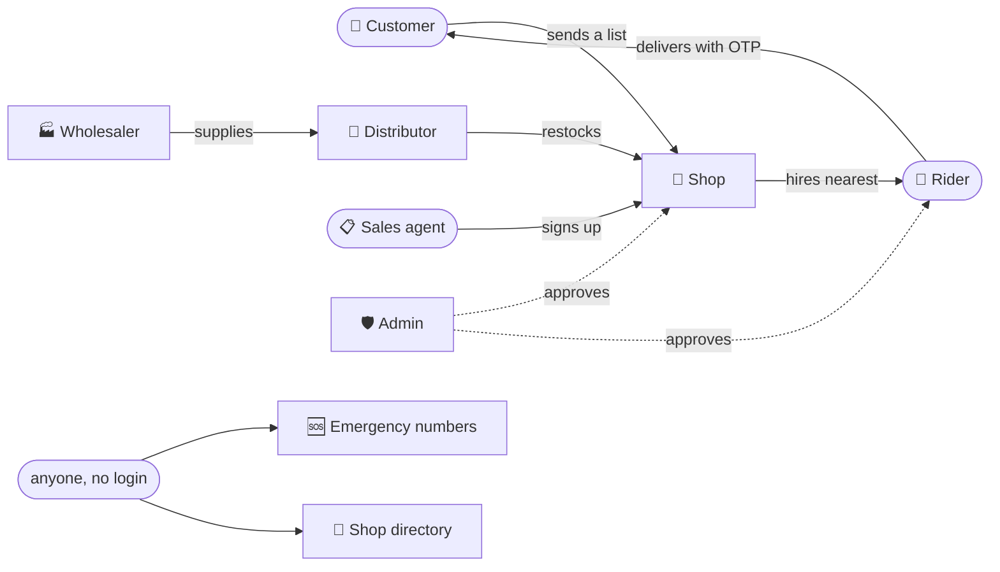
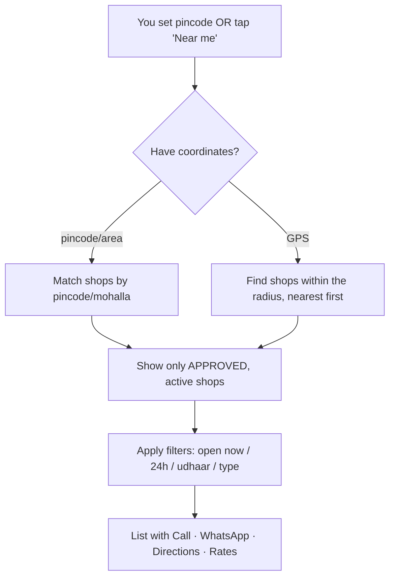
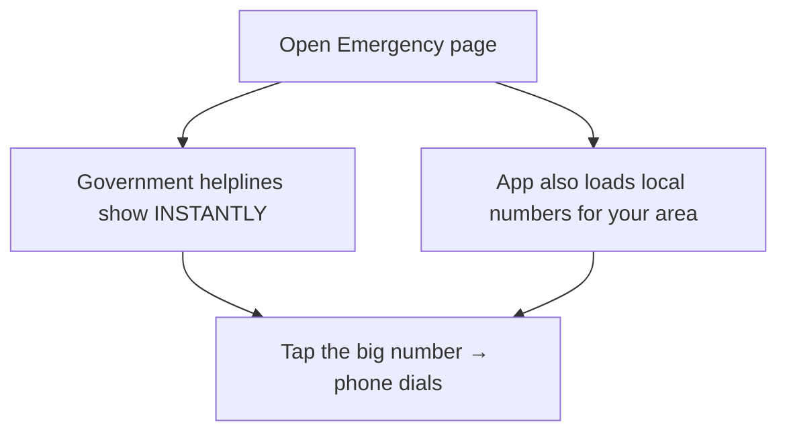
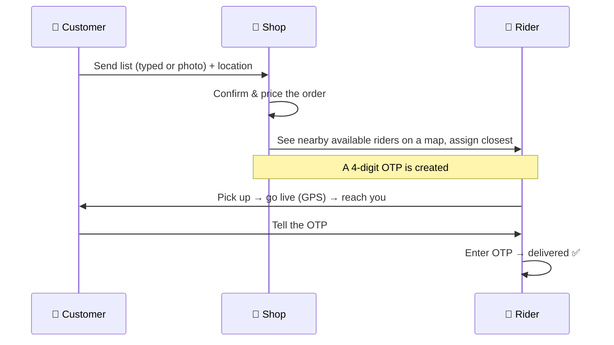
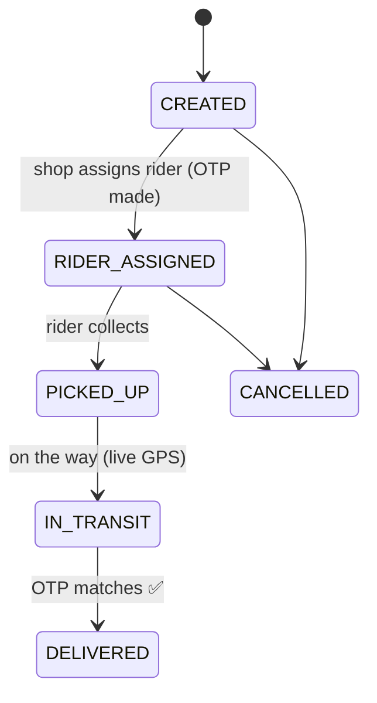
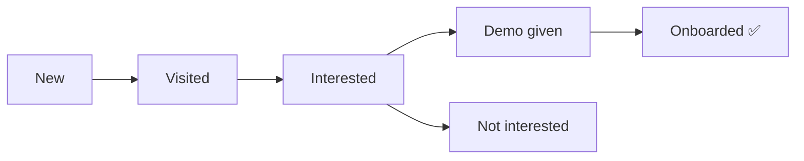
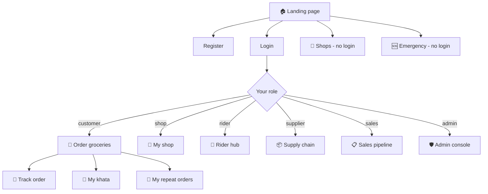
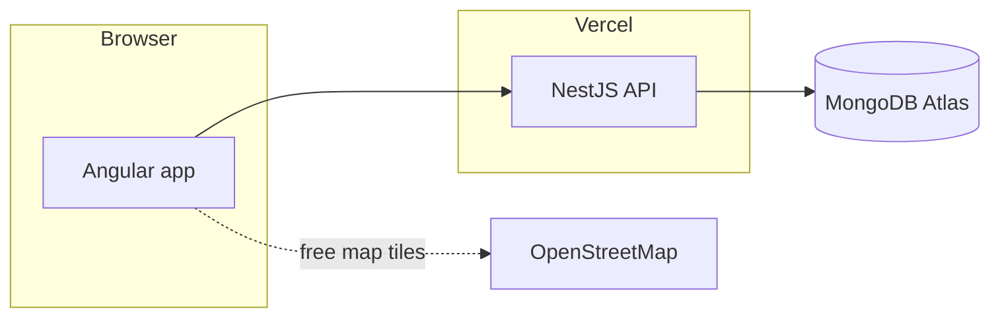

# RideFleet — Complete Guide (what everything does)

A plain-language guide to every feature, every button, and how things flow.
No jargon. If you can read a shop signboard, you can read this.

- **Website:** https://vendor-management-jade.vercel.app
- **What it is:** one app that connects a town's **shops**, **customers**,
  **delivery riders**, **suppliers**, and **emergency numbers** — built for
  small cities, towns and kasbas, in **English and हिंदी**.

> All the diagrams below render automatically on GitHub. If you're reading this
> in a plain text editor, they're written as simple boxes-and-arrows too.

---

## 1. Try it right now (demo data is already live)

Real demo records are seeded on the live site. You can see them without creating
anything:

1. Open **https://vendor-management-jade.vercel.app/shops**
2. In **Pincode**, type **`452001`** → Search. Two shops appear:
   **Sanjeevani Medical Store** (24×7) and **Shivam Water Suppliers**.
3. Tap **📞 Call**, open the **Rate list**, or (as a customer) **🛒 Order**.

**Demo logins** — use them to click around each role. Password for all the
**demo** accounts is `Demo@1234`:

| Role | Email | Password | Lands on |
|------|-------|----------|----------|
| Customer | `demo.customer@ridefleet.test` | `Demo@1234` | Order groceries |
| Shop owner | `demo.kirana@ridefleet.test` | `Demo@1234` | My shop (orders, khata, rates) |
| Rider | `demo.rider@ridefleet.test` | `Demo@1234` | Rider hub |
| Field sales | `demo.sales@ridefleet.test` | `Demo@1234` | Sales pipeline |
| Admin | `admin@vendor.com` | *(your own admin password)* | Admin console |

> The demo accounts are throwaway test data — fine to experiment with. The admin
> password is your private one (set in the backend's Vercel env), never `Demo@1234`.

---

## 2. The people (roles)

Everyone signs up once and picks **who they are**. That choice decides the whole
experience.

| Role | Icon | What they do | Needs admin OK? |
|------|:---:|--------------|:---:|
| **Customer** | 🛒 | Order from nearby shops, pay cash / on khata / online | No |
| **Shop owner** | 🏪 | Any shop — kirana, medical, water, gas, sabzi… take orders, keep khata | **Yes** |
| **Shop staff** | 🧑‍💼 | Work the counter for a shop — take orders, write khata (no settings) | No* |
| **Rider** | 🛵 | Deliver for any shop, on their own hours | **Yes** |
| **Wholesaler** | 🏭 | Sell in bulk to shops | **Yes** |
| **Distributor** | 🚚 | Buy from wholesalers, supply shops | **Yes** |
| **Service provider** | 🛠️ | Electrician, plumber, tanker, mechanic… | **Yes** |
| **Field sales agent** | 📋 | Sign up shops in a town, earn per shop | **Yes** |
| **Admin** | 🛡️ | Approves shops & riders, runs the platform | — |

\* Shop staff are added by their shop owner, so they're trusted automatically.

“Needs admin OK” means: you can sign up and set everything up immediately, but
you go **live** (visible to customers) only after the admin approves you. While
you wait, you see a friendly ⏳ banner.

---

## 3. The big picture



Two things work **without any login at all** — because in a real emergency or
when you just need a shop's phone number, a signup screen is useless:

- **🆘 Emergency** — government helplines + local numbers
- **🔎 Shop directory** — find any shop and call it

---

## 4. Feature by feature (what each button does)

### 4.1 🔎 Shop directory — “which shop, and is it open?”

**Where:** the **Shops** tab, or `/shops`. No login needed.

**What you can do:**

| Button / control | What it does |
|---|---|
| **Quick-need tiles** (💊 Medicine, 💧 Water, 🔥 Gas, 🥬 Sabzi, 🥛 Milk, 🛒 Kirana) | One tap shows just that kind of shop |
| **Search box** | Type a shop name, an item, a **mohalla**, or a **pincode** |
| **🕒 Open now** | Hides shops that are shut right now |
| **🌙 24 hours** | Only always-open shops (medical, water, gas) |
| **📒 Gives udhaar** | Only shops that keep a credit book |
| **📍 Near me** | Uses your GPS to sort by distance |
| **📞 Call** | Dials the shop directly |
| **WhatsApp** | Opens WhatsApp with a ready-made “I'd like to order…” message |
| **🧭 Directions** | Opens Google Maps to the shop |
| **📋 Rate list** | Shows the shop's price board, in place |
| **🛒 Order** | (customers) Jump straight to ordering from this shop |
| **← Back / 🏠 Home / My dashboard** | Top bar — always a way back |

**How “shops in this area” works** (verified live — Indore shows the shops, a
Mumbai search does not):



---

### 4.2 🆘 Emergency — “I need help now”

**Where:** the **Emergency** tab, or `/emergency`. No login needed. Works even
with **no balance** and on a weak signal (the government numbers are built into
the app, not downloaded).

| Section | What it gives |
|---|---|
| **Do this first** | Short safety steps for gas / fire / medical / live wire |
| **Government helplines** | 112, 108 (ambulance), 101 (fire), 100 (police), 1906 (gas), 1912 (electricity), 1091 (women), 1098 (child)… — one big tap to call |
| **Filter chips** | Ambulance, Hospital, Night chemist, Blood bank, Fire, Police, Gas leak, Water tanker, Cattle/pets… |
| **Local numbers** | Your town's own ambulance / hospital / tanker, added by the admin (a ✓ means verified) |
| **City / Pincode search** | Find local numbers for your area |



---

### 4.3 🛒 Ordering — from a list to your door

**Who:** customers (and shop owners can also take a phone order for a customer).

**The journey** (all steps verified live — a real order `RF-20260910-0001` was
placed, priced, and assigned a rider):



**What the buttons do:**

| Button | What it does |
|---|---|
| **Deliver to** | Your address + **landmark** (“peepal ped ke paas”) — riders navigate by this |
| **Your list** | Type items one per line, the way you say them |
| **Send a photo** | Snap a handwritten list instead |
| **Cash on delivery / On my khata / Pay online** | How you'll pay |
| **Place order** | Sends it to the shop |
| **Track** | Live map of the rider moving to you |
| **Bill** | Itemised invoice (items + delivery fee + total) |

**Fair delivery fee:** ₹20 base + ₹8 per km, from the real distance. (In the
live test, a ~0.3 km drop = **₹22**.)

**Order status** moves through these stages:



---

### 4.4 📒 Khata (udhaar) — the digital credit book

The single most-used thing in a kirana. Goods now, payment on salary day — but
now **both the shop and the customer see the same number**, so no arguments.

**Shop owner / staff — “Udhaar khata” tab:**

| Button | What it does |
|---|---|
| **Goods on udhaar** | Add what a customer took on credit (balance goes **up**) |
| **Payment received** | Record cash/UPI they paid (balance comes **down**) |
| **Customer list** | Everyone who owes, biggest balance first |
| **Total udhaar outstanding** | How much the whole street owes you |

**Customer — “My khata”:** sees exactly what they owe, at every shop, with the
shop's UPI to pay. (Verified live: shop gave ₹250, customer paid ₹100 → both
sides show **₹150** owing.)

The customer is matched by **phone number**, so even a customer who never
installs the app still has a ledger the shopkeeper can keep.

---

### 4.5 🔁 Repeat orders (refills) — water can, gas, milk

For things you buy again and again. Set it once; the shop gets a **dated list**
each morning.

| Who | What they see |
|---|---|
| **Customer** | “Set a repeat order” → item, quantity, how often (daily / weekly / monthly). Can **snooze** (“we're away till Sunday”). |
| **Shop** | Today's **delivery round** — what's **due today** first (a missed water can = someone with nothing to drink), then upcoming. Tap **Delivered** and the next date rolls forward automatically. |

---

### 4.6 🏪 Running a shop

**“My shop” has tabs:**

| Tab | What it's for |
|---|---|
| **Orders** | Incoming orders → **Find rider** (map of nearby riders) → **Assign** |
| **Udhaar khata** | The credit book (above) |
| **Repeat orders** | The refill round (above) |
| **Rate list** | Publish your price board so customers can see & order |
| **Staff** | Add helpers by mobile/email — they can take orders & write khata, but can't change settings |
| **Shop details** | Timings, WhatsApp, UPI, delivery radius, 24×7, “gives udhaar” |

| Key control | What it does |
|---|---|
| **Shop is open / Closed for today** | The **shutter switch** — pause orders for the day without going offline. (Verified: a closed shop disappears from “open now”.) |
| **Find rider** | Shows available riders near your shop on a map |
| **Assign** | Hires that rider; a 4-digit **OTP** is created for the handoff |

---

### 4.7 🛵 Being a rider

| Button | What it does |
|---|---|
| **Create rider profile** | Your vehicle (bike/scooter/cycle…) — then wait for admin OK |
| **AVAILABLE / OFFLINE** | Turn work on/off on your own schedule |
| **Set location / 📡 Go Live** | Share GPS so the shop & customer see you move |
| **Accept → Picked up → Deliver** | Work the order; **Deliver** needs the customer's OTP |

Your delivery count and earnings update automatically on each drop.

---

### 4.8 📋 Field sales — signing up a town

For the agent who walks shop-to-shop getting the town onto the app.

| Button | What it does |
|---|---|
| **Add a shop I visited** | Create a lead (shop name, owner, area, phone) |
| **Log visit** | Record what happened, set the next follow-up |
| **Scorecard** | Pipeline by stage, follow-ups due today, shops onboarded, shops **live**, and an estimated incentive |



---

### 4.9 🛡️ Admin console

| Tab | What it's for |
|---|---|
| **Overview** | Pending shops & riders → **Approve / Reject** |
| **Stores / Riders / Orders** | See and manage everything platform-wide |
| **Suppliers** | Approve wholesalers & distributors |
| **Emergency** | Add / verify local emergency numbers |

---

### 4.10 🌐 Made for small-town phones

| Feature | Why it matters |
|---|---|
| **हिं / EN toggle** | The whole app flips language instantly; your choice follows your account to any device |
| **🐢 Data saver** | Turns off maps, photos and animation — no map tiles downloaded, saves your data pack on 2G |
| **A+ Bigger text** | One tap makes everything larger |
| **Landmark addresses** | “Behind Hanuman mandir” instead of a GPS pin on the wrong lane |
| **Tap-to-call + WhatsApp everywhere** | The fastest thing is often a phone call, not an order form |
| **Bottom bar on phones** | The things you do most are within thumb reach |

---

## 5. Every screen, and how you move between them



---

## 6. How the app is built (for the technical reader)



- **Frontend:** Angular (the `vendor-management` Vercel project).
- **Backend:** NestJS serverless API (the `vendor-management-x1v1` project).
- **Database:** MongoDB Atlas. Shops, riders and emergency contacts use a
  **geo index**, which is how “shops in this area / near me” works.
- **A push to `main` deploys both.**

---

## 7. Health checks (is it working?)

| Check | Open this | Good sign |
|---|---|---|
| API alive | `…-x1v1.vercel.app/health` | `{"status":"ok"}` |
| Emergency data | `…-x1v1.vercel.app/public/emergency` | list of helplines |
| Shops in demo area | `…-x1v1.vercel.app/public/shops?pincode=452001` | 2 demo shops |

**Run the full check yourself** — one script seeds demo data and verifies every
feature end-to-end, then prints a PASS/FAIL list:

```bash
ADMIN_PW='your-admin-password' node scripts/smoke-test.mjs
# or against a local backend:
API='http://localhost:3000' ADMIN_PW='admin123' node scripts/smoke-test.mjs
```

Last full run: **37/37 features passed** — accounts, shops, geo search,
ordering, rider assignment with OTP, khata, refills, emergency, sales, and
language, all verified on the live site.

---

## 8. One-line summary

> **RideFleet is a phone-first app that lets a town find any shop, order from it,
> pay cash / on khata / online, get it delivered by a shared rider with an OTP —
> and, when it matters most, reach an emergency number without even logging in.**
